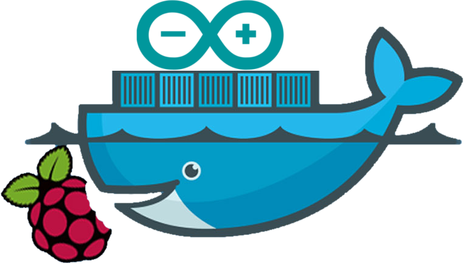

# FROM PAAS:1.10 ADD raspberry RUN arduino

<figure style="margin-top: -200px; float: left;">
    
</figure>

## Antinomie

*Définition wikipedia*

> Antinomie, grec ancien « ἀντινομία » (« antinomía ») signifiant une « contradiction entre les lois&nbsp;»  
> Est un type de contradiction logique, dans lequel des déclarations mutuellement contradictoires sont tout aussi bien fondées et prouvées (dans le cas des systèmes formels).

 
<!-- .element class="fragment fade-in" -->
**Docker** : environnements virtuels, abstraction complète du matériel et logiciel  **Arduino** : on est pratiquement dans le proc

## Sommaire

<!-- .slide: id="master-toc" class="toc" -->

- [Arduino](#/1)
- [Docker](#/2)

<figure style="margin-top: 200px; float: right; width: 50%">
    
</figure>

