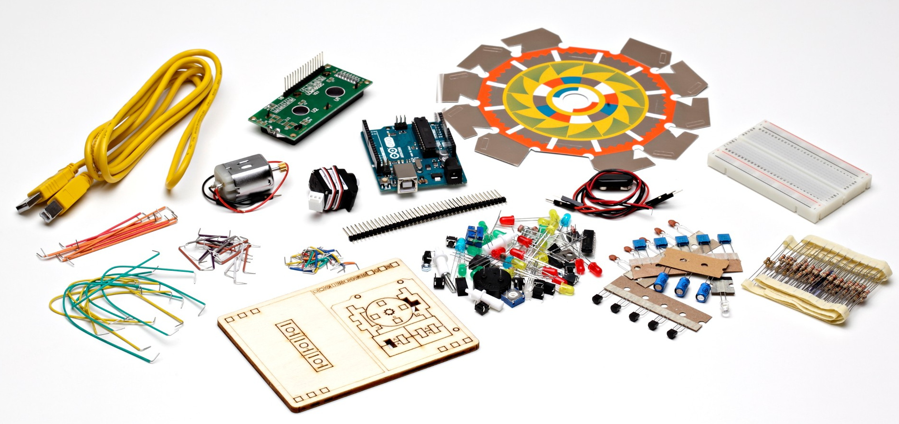
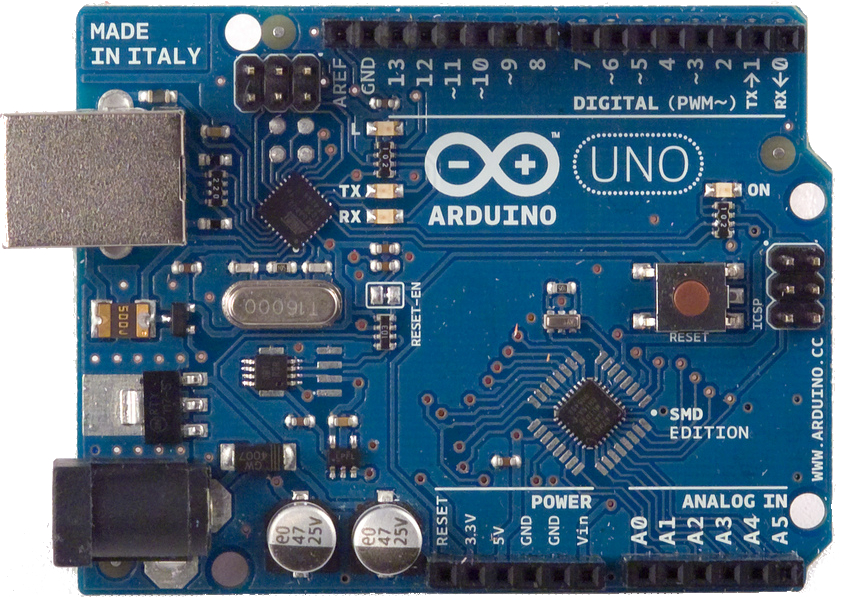
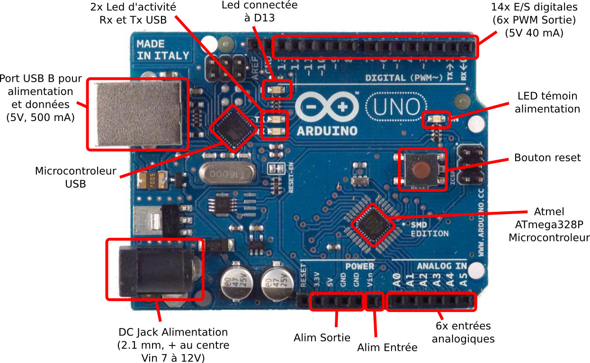
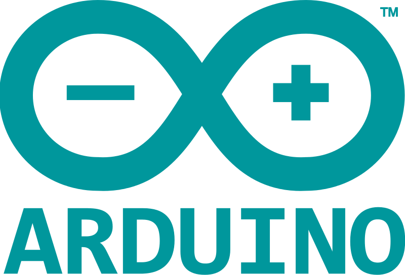
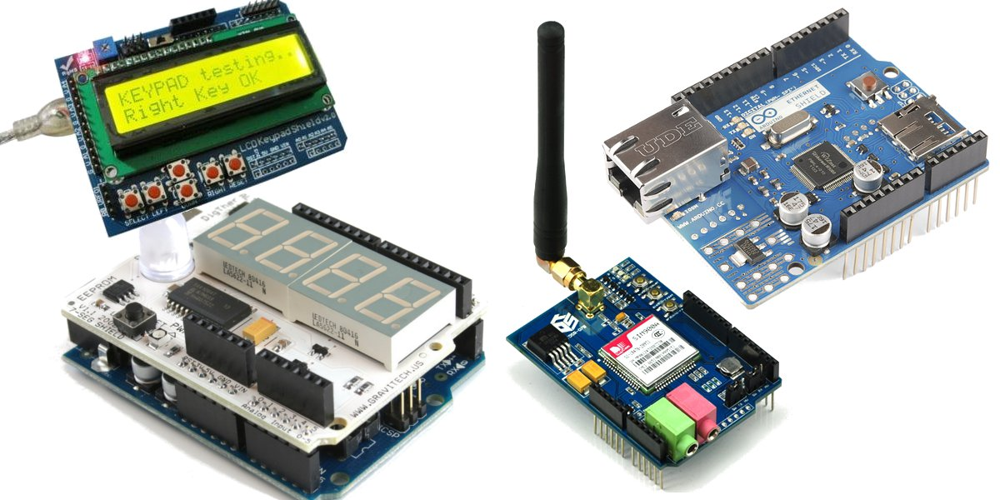
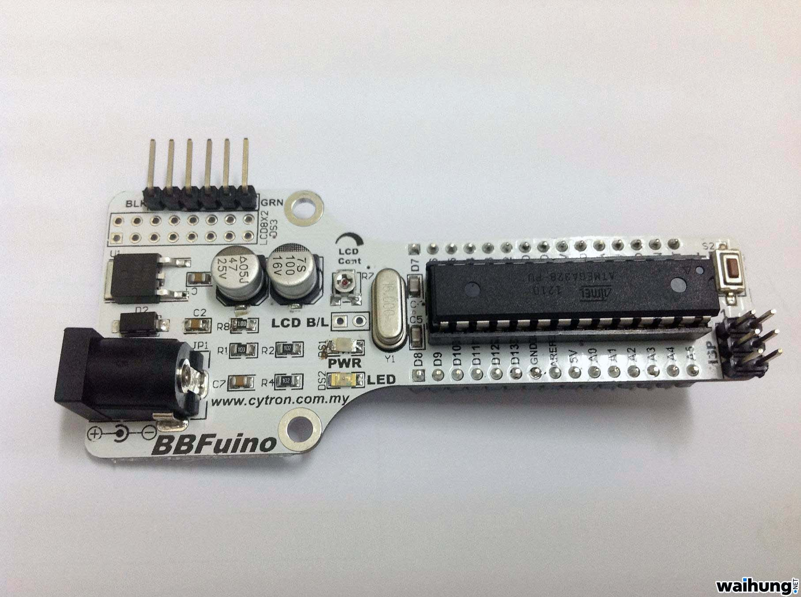
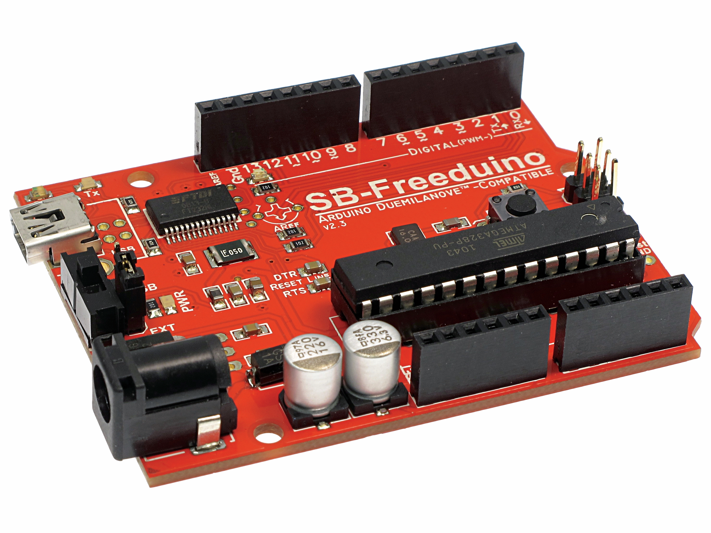
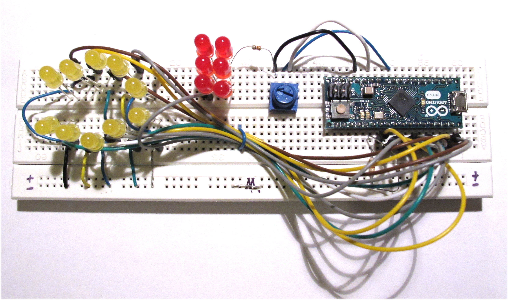

# Arduino

<figure style="margin-top: -200px; float: left; width: 80%">
    
</figure>


## Arduino : qu'est ce ?


<figure style="position: absolute; top: 350px; right: 0; width: 50%">
    
</figure>

**www.arduino.cc**
> Arduino is an open-source prototyping platform based on easy-to-use hardware and software.

<br>

Caractéristiques d'un Arduino Uno

- Microcontroleur ATMEL 8 bit @ 16 MHz
 - 32 Ko de Flash
 - 2Ko de SRAM + 1Ko de EEPROM
 - 14x I/O digitales
   - dont 6x PWM + 2x Serie + 4x SPI
 - 8x entrées analogiques
   - dont 2x I2C


## En détails




## Logiciels

- Pas de système d'exploitation
- Uniquement le programme s'exécute dessus.
- Gestion des interruptions à coder si necessaire
- Le debug se fait à coup de reboot et à la LED...
- Pas de BSOD :'(


## Pourquoi ça marche ?
<br>

> Pour programmer un micro controleur, <br>il faut un microcontroleur programmé...

<br>
Problème de la poule et l'oeuf

<figure style="margin-top: -100px; float: left; margin-left: 20%">
    
</figure>


## Solutions apportées

<figure style="position: absolute; top: 500px; right: 0; width: 30%">
    
</figure>

<br>
Arduino intègre sur une même platine

 - un programmateur (déjà programmé...) + un microcontroleur de "run"
 - une prise USB + des connecteurs multi-fonctions
 - Logiciels libre et gratuit
    - bootloader ( ~ "bios d'un PC" )
    - SDK + chaine de cross compilation + IDE simple
    - Multi plateforme


## Extensions

Shield = carte d'extension se branchant sur les pins de la carte




## Connexion

- USB avec un PC
 -  Alimentation de la carte + shield
 -  Port série émulé sur USB
   - Facile d'accès
   - Interopérable
<br> <br> <br>

Accès linux
```bash
cu -l /dev/ttyACM0 -s 9600
```
Mac OS X
```bash
screen /dev/cu.usbmodem1421
```


## Nombreux clones existant

<figure style="display: block; float: left; margin: 30px 0; width: 40%">
    
    <figcaption>BBFuino</figcaption>
</figure>

<figure style="display: block; float: left; margin: 0; width: 40%">
    
    <figcaption>SB-Freeduino</figcaption>
</figure>


## Exemple de code

- Code écrit en C = sketch
- Clignotement d'une LED :

```c
// the setup function runs once when you press reset or power the board
void setup() {
  // initialize digital pin 13 as an output.
  pinMode(13, OUTPUT);
}

// the loop function runs over and over again forever
void loop() {
  digitalWrite(13, HIGH);   // turn the LED on (HIGH is the voltage level)
  delay(1000);              // wait for a second
  digitalWrite(13, LOW);    // turn the LED off by making the voltage LOW
  delay(1000);              // wait for a second
}
```

Quelques autres fonctions : 
```c
digitalRead()
analogRead() 
analogWrite()
...
```


## Schéma électronique

<figure style="margin-top: 0%; margin-left: 15%; width: 70%">
    
</figure>


## Matériel présenté

Arduino micro




## Démo

<figure style="margin-top: 0%; margin-left: 15%; width: 70%">
    
</figure>


## Comparaison avec du matériel connu

Matériel 

|  Plateforme | CPU                                                       | RAM  | Flash | 
|-------------|-----------------------------------------------------------|------|-------|
| Arduino     | 16 Mhz                                                    | 2&nbsp;Ko |   32&nbsp;Ko  |
| Rpbi 2      | Arm A7 Quad core@900 Mhz                                  | 1&nbsp;Go | -     |
| Samsung S4 GT-I9505 | Arm A15@1.6 GHz Quad&nbsp;core +<br> Arm A7@1.2 Ghz Quad&nbsp;core | 2&nbsp;Go | 16&nbsp;Go |
| MBP         | Intel i5 x86_64@2.7 Ghz Quad core | 8&nbsp;Go | 250&nbsp;Go |

 
<br>
Consommation en Idle

| Plateforme | Idle (W)  | Burn (W)
|------------|-----|-----|
| Arduino    | 0.170 (=> 0.011) | 0.2 |
| Rpbi 2     | 1.1  |  4.5 |

