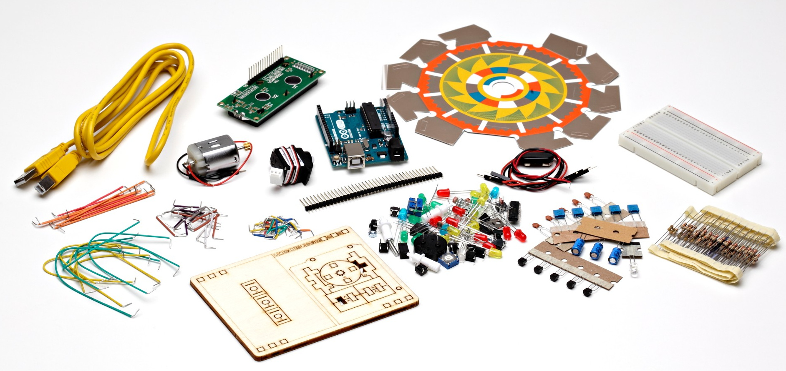
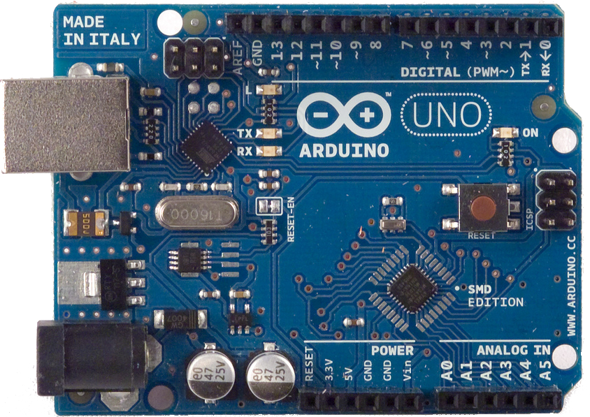
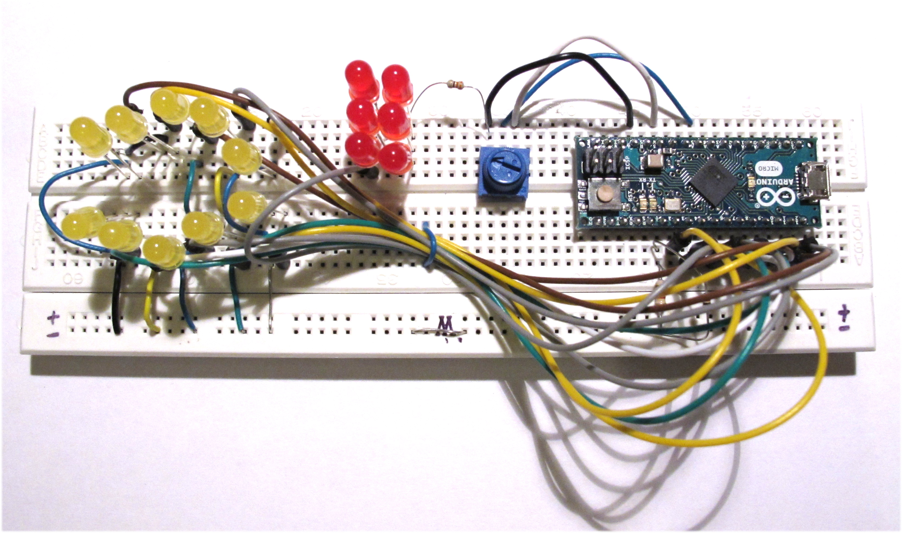

# FROM PAAS:1.10<br>ADD raspberry<br>RUN arduino

<figure style="margin-top: -200px; float: left;">
    
</figure>


## Antinomie

*Définition wikipedia*

> Une antinomie, qui vient du grec ancien « ἀντινομία » <br> (« antinomía ») signifiant une « contradiction entre les lois », est un type de contradiction logique, dans lequel des déclarations mutuellement contradictoires sont tout aussi bien fondées et prouvées (dans le cas des systèmes formels).

- Docker : environnements virtuels, abstraction complète du matériel et logiciel
- Arduino : on est pratiquement dans le proc


# Arduino

<figure style="margin-top: -200px; float: left; width: 80%">
    
</figure>


## Arduino : qu'est ce ?


<figure style="position: absolute; top: 100px; right: 0; width: 50%">
    
</figure>

Arduino Uno

- Microcontroleur 8 bit @ 16 MHz
 - 32 Ko de Flash
 - 2Ko de SRAM
 - 1Ko de EEPROM
 - 14x I/O digitale
   - 6x PWM
   - 2x Serie
   - 4x SPI
 - 8x entrées analogiques
   - 2x I2C


## En détails


## Logiciels

- Pas de système d'exploitation
- Uniquement le programme s'exécute dessus.
- Gestion des interruptions à coder si necessaire
- Le debug se fait à coup de reboot et à la LED...
- Pas de BSOD :'(


## Pourquoi ça marche ?
<br>

> Il fût un temps où pour programmer un micro controleur, il fallait un microcontroleur programmé...

<br>
Problème de la poule et l'oeuf

<figure style="margin-top: -100px; float: left; margin-left: 20%">
    
</figure>


## Solutions apportées

<figure style="position: absolute; top: 100px; right: 0; width: 35%">
    
</figure>

<br>
Arduino intègre sur une même platine

 - un programmateur (déjà programmé...)
 - une connectique USB
 - un microcontroleur de "run"
 - des broches faciles d'accès
 - un format de carte constant au fil des versions
 
 - Fournit un SDK + IDE simple d'utilisation libre et gratuit


## Extensions

Shield = carte d'extension se branchant sur les pins de la carte


## Connexion

- USB avec un PC
 -  Alimentation de la carte + shield
 -  Port série émulé sur USB
   - Parmi les standards de l'industrie en carte de dev
   - Facile d'accès
   - Ré-utilisation importante de (vieux) outils
<br> <br> <br>

Accès linux
```bash
cu -l /dev/ttyACM0 -s 9600
```
Mac OS X
```bash
screen /dev/cu.usbmodem1421
```


## Philosophie
**www.arduino.cc**
> Arduino is an open-source prototyping platform based on easy-to-use hardware and software.

<br>

- Schéma électronique de la platine libre et opensource
<br> <br>

- Logiciels libre et opensource :
  - bootloader ( ~ "bios d'un PC" )
  - SDK
  - IDE
  - Multi plateforme


## Nombreux clones existant

<figure style="display: block; float: left; margin: 30px 0; width: 40%">
    
    <figcaption>BBFuino</figcaption>
</figure>

<figure style="display: block; float: left; margin: 0; width: 40%">
    
    <figcaption>SB-Freeduino</figcaption>
</figure>


## Matériel présenté

Arduino micro




## Exemple de code

- Code écrit en C = sketch
- Clignotement d'une LED :

```c
// the setup function runs once when you press reset or power the board
void setup() {
  // initialize digital pin 13 as an output.
  pinMode(13, OUTPUT);
}

// the loop function runs over and over again forever
void loop() {
  digitalWrite(13, HIGH);   // turn the LED on (HIGH is the voltage level)
  delay(1000);              // wait for a second
  digitalWrite(13, LOW);    // turn the LED off by making the voltage LOW
  delay(1000);              // wait for a second
}
```

Quelques autres fonctions : 
```c
digitalRead()
analogRead() 
analogWrite()
...
```


## Démo

<figure style="margin-top: 0%; margin-left: 15%; width: 70%">
    
</figure>


## Comparaison avec du matériel connu

Matériel 

|  Plateforme | CPU                                                       | RAM  | Flash | 
|-------------|-----------------------------------------------------------|------|-------|
| Arduino     | 16 Mhz                                                    | 2&nbsp;Ko |   32&nbsp;Ko  |
| Rpbi 2      | Arm A7 Quad core@900 Mhz                                  | 1&nbsp;Go | -     |
| Samsung S4 GT-I9505 | Arm A15@1.6 GHz Quad&nbsp;core +<br> Arm A7@1.2 Ghz Quad&nbsp;core | 2&nbsp;Go | 16&nbsp;Go |
| MBP         | Intel i5 x86_64@2.7 Ghz Quad core | 8&nbsp;Go | 250&nbsp;Go |

 
<br>
Consommation en Idle

| Plateforme | Idle (W)  | Burn (W)
|------------|-----|-----|
| Arduino    | 0.170 (=> 0.011) | 0.2 |
| Rpbi 2     | 1,1  |  4.5 |


# Docker

<figure style="margin-top: -400px; float: left">
    
</figure>


## Raspberry

- Docker sur proc ARM est supporté depuis la v1.0
- Tout ce que je vous présente tourne sur le PI (fwk zenika également)
  - Distribution hypriotOS 
    - base raspbian avec docker 1.10
    - http://blog.hypriot.com/
- Choix lié au pb pour faire fonctionner ma VM docker-machine virtualbox sous Mac OS X pour la communication avec l'arduino

<figure style="float: right; ">
    
</figure>


## Rappel des conteneurs


Ici, ce qui nous interesse est le partage du noyau entre l'hôte et l'invité


## Accès au port série depuis un conteneur

Sous linux, un fichier spécial ```/dev/ttyACM0``` est créé lors du branchement de l'arduino

Pour se connecter à l'arduino : 
```shell
cu -l /dev/ttyACM0 -s 115200
```
<br>

Idée : mapping de ```/dev/ttyACM0``` de l'hôte dans le conteneur

```shell
docker run -v /dev/ttyACM0:/dev/ttyACM0 monimage
```

<br><br>

**Si seulement...**


## Un peu de sécurité

- Pour des questions de «sécurité», la commande précédente ne passe pas, le conteneur n'a pas les droits suffisants
- Il faut passer en mode **privileged**
```shell
docker run --privileged ...
```
L'option ```--privileged``` coupe toutes les sécurités de runtime appliquée à un conteneur (les namespaces PID, NET, IPC... ne sont plus utilisés)
- Alternative : l'option ```--device``` mappe le device dans le conteneur avec les droits suffisants pour y accéder (et juste sur ce qui est spécifié)
```shell
docker run --device=/dev/ttyACM0:/dev/ttyACM0 ...
```

<figure style="float: right; ">
    
</figure>


## Le conteneur démarre

**Et après ?**

- L'arduino est autonome et peut communiquer avec un ordinateur.
  - Exemples : relevé de sondes de temperatures, pilotage de radiateur, robot simple, machine enigma
  - Contraintes : le programme doit tenir dans 28 Ko de flash et 2 Ko de RAM...

<br>
Dès qu'il s'agit de faire plus intelligent (robot autonome, reconnaissance de voix, débitmètre de tireuse de bière...) un ordinateur plus puissant peut être nécessaire.

- Quid de la communication entre les 2 ?


## Communication

- Solution naïve : développer un programme coté ordinateur émettant des ordres au format texte via le port USB à l'arduino
  - L'arduino exécute le programme maitre et ne "remonte" que les infos
  - Très simple à mettre en oeuvre
  - Ultra documenté
  - Exemple : https://gitlab.com/coliss86/arduino-controller

```
> h
    ___          _       _
   / _ \        | |     (_)
  / /_\ \_ __ __| |_   _ _ _ __   ___
  |  _  | '__/ _` | | | | | '_ \ / _ \
  | | | | | | (_| | |_| | | | | | (_) |
  \_| |_/_|  \__,_|\__,_|_|_| |_|\___/

Help
Command available :
      <pin number [2-9]>=<0,1>
      h - help
      s - i/o status
```


## Solution plus évoluée

- Sketch Firmata 
  - Protocole binaire, documenté
  - L'arduino n'est plus qu'un esclave et ne contient plus aucune logique
  - L'ordinateur exécute le programme et lui délègue les taches au plus proche du matériel
  - https://github.com/firmata/arduino
  - De nombreux languages ont une lib kivabien &copy; <br>python, perl, ruby, java, js, php, Haskell, golang...


## Johnny-five

- Lib node.js permettant d'utiliser ce protocole
- Exemple : 

```javascript
var five = require("johnny-five");
var board = new five.Board();

board.on("ready", function() {

  var led = new five.Led(13);

  // "blink" the led in 500ms on-off phase periods
  led.blink(500);
});

```


## Appli de démo

- Client twitter qui réagit au tweet sur #technozaure **~90 lignes de code**
https://gitlab.com/coliss86/technozaure-arduino

```javascript
var five = require("johnny-five");
var Twitter = require('twitter');
var board = new five.Board();
var client = new Twitter({...});
...
board.on("ready", function() {
  var ledPins = [2,4,5,6,7,8,9,10,11,12];
  var leds = new five.Leds(ledPins);
...
  client.stream('statuses/filter', {track: '@technozaure'},  function(stream){
    stream.on('data', function(tweet) {
      console.log(tweet.text);
      board.wait(60, function(){
        leds.each(function(led, index) {
        led.on();
      });
    });
  });
});

```


## Questions ?


