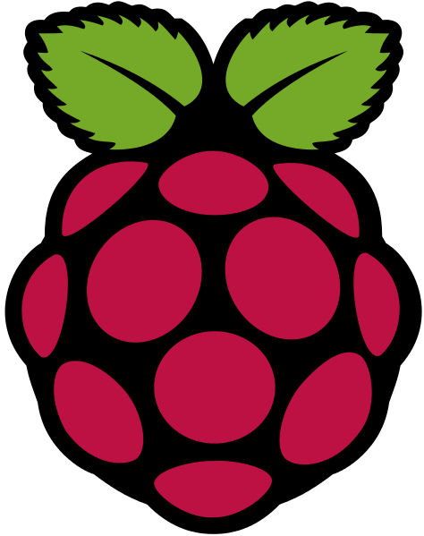

# Docker

<figure style="margin-top: -400px; float: left">
    
</figure>


## Raspberry

- Docker sur proc ARM est supporté depuis la v1.0
- Tout ce que je vous présente tourne sur le PI (fwk zenika également)
  - Distribution hypriotOS 
    - base raspbian avec docker 1.10
    - http://blog.hypriot.com/
- Choix lié au pb pour faire fonctionner ma VM docker-machine virtualbox sous Mac OS X pour la communication avec l'arduino

<figure style="float: right; ">
    
</figure>


## Docker "multiplateforme"

- Docker n'est pas comme java : « build once, run anywhere ».
- Anywhere = n'importe quelle plateforme avec une jvm équivalente : 
  - OS différent : Windows, OS X, Linux, Solaris...
  - Architecture matérielle différente : 686, x86_64, ARM...
- Les images docker sont liées à une architecture en particulier : pas de possibilité d'executer sur du ARM une image x86_64
- le docker hub et le client docker ne font pas (encore?) apparaitre cette information
- Utilisation d'image construite sur un ARM


## Rappel des conteneurs


Ici, ce qui nous interesse est le partage du noyau entre l'hôte et l'invité


## Accès au port série depuis un conteneur

Sous linux, un fichier spécial ```/dev/ttyACM0``` est créé lors du branchement de l'arduino

Pour se connecter à l'arduino : 
```shell
cu -l /dev/ttyACM0 -s 115200
```
<br>

Idée : mapping de ```/dev/ttyACM0``` de l'hôte dans le conteneur

```shell
docker run -v /dev/ttyACM0:/dev/ttyACM0 monimage
```

<br><br>

**Si seulement...**


## Un peu de sécurité

- Pour des questions de «sécurité», la commande précédente ne passe pas, le conteneur n'a pas les droits suffisants
- Il faut passer en mode **privileged**
```shell
docker run --privileged ...
```
L'option ```--privileged``` coupe toutes les sécurités de runtime appliquée à un conteneur (les namespaces PID, NET, IPC... ne sont plus utilisés)
- Alternative : l'option ```--device``` mappe le device dans le conteneur avec les droits suffisants pour y accéder (et juste sur ce qui est spécifié)
```shell
docker run --device=/dev/ttyACM0:/dev/ttyACM0 ...
```

<figure style="float: right; ">
    
</figure>


## Le conteneur démarre

- Une fois démarré, le port série est accessible
- Il est possible de conteneuriser l'environnement de build
- Attention : docker et les IHM ne sont pas copains
  - il faut passer par un serveur X en mémoire (Xvfb) et se connecter en VNC, ou utiliser la socker X11...
- Plusieurs projets pour arduino
  - Arduino CLI
  - PlatformIO
  - Ino (non maintenu)
- Pas d'image dispo, à construire


## Mais encore ?

- L'arduino est autonome et peut communiquer avec un ordinateur.
  - Exemples : relevé de sondes de temperatures, pilotage de radiateur, robot simple, machine enigma
  - Contraintes : le programme doit tenir dans 28 Ko de flash et 2 Ko de RAM...

<br>
Dès qu'il s'agit de faire plus intelligent (robot autonome, reconnaissance de voix, débitmètre de tireuse de bière...) un ordinateur plus puissant peut être nécessaire.

- Quid de la communication entre les 2 ?


## Communication

- Solution naïve : développer un programme coté ordinateur émettant des ordres au format texte via le port USB à l'arduino
  - L'arduino exécute le programme maitre et ne "remonte" que les infos
  - Très simple à mettre en oeuvre
  - Ultra documenté
  - Exemple : https://gitlab.com/coliss86/arduino-controller

```
> h
    ___          _       _
   / _ \        | |     (_)
  / /_\ \_ __ __| |_   _ _ _ __   ___
  |  _  | '__/ _` | | | | | '_ \ / _ \
  | | | | | | (_| | |_| | | | | | (_) |
  \_| |_/_|  \__,_|\__,_|_|_| |_|\___/

Help
Command available :
      <pin number [2-9]>=<0,1>
      h - help
      s - i/o status
```


## Solution plus évoluée

- Sketch Firmata 
  - Libre et open source
  - Protocole binaire, documenté
  - L'arduino n'est plus qu'un esclave et ne contient plus aucune logique
  - L'ordinateur exécute le programme et lui délègue les taches au plus proche du matériel
  - https://github.com/firmata/arduino
  - De nombreux languages ont une lib kivabien &copy; <br>python, perl, ruby, java, js, php, Haskell, golang...


## Johnny-five

- Lib node.js permettant d'utiliser ce protocole
- Exemple : 

```javascript
var five = require("johnny-five");
var board = new five.Board();

board.on("ready", function() {

  var led = new five.Led(13);

  // "blink" the led in 500ms on-off phase periods
  led.blink(500);
});

```


## Appli de démo

- Client twitter qui réagit au tweet sur #technozaure **~90 lignes de code**
https://gitlab.com/coliss86/technozaure-arduino

```javascript
var five = require("johnny-five");
var Twitter = require('twitter');
var board = new five.Board();
var client = new Twitter({...});
...
board.on("ready", function() {
  var ledPins = [2,4,5,6,7,8,9,10,11,12];
  var leds = new five.Leds(ledPins);
...
  client.stream('statuses/filter', {track: '@technozaure'},  function(stream){
    stream.on('data', function(tweet) {
      console.log(tweet.text);
      board.wait(60, function(){
        leds.each(function(led, index) {
        led.on();
      });
    });
  });
});

```


## Démo

<figure style="margin-top: 0%; margin-left: 15%; width: 70%">
    
</figure>


<!-- .slide: class="page-questions" -->

<figure style="height: 100%">
    
</figure>

